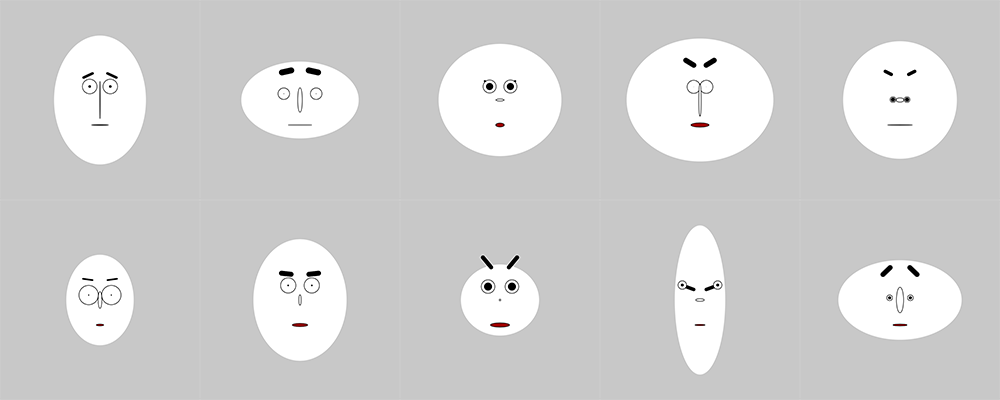

# Object

According to the textbook, *Make:Getting Started with p5.js*, an object combines related data (properties) with related actions and behaviors (methods). 

We know that a variable is used to store data:
```js
var num = 50;
var name = "Cindy";
```

We can also use *an object* to group data together. Here is an object literal:

```js
var person1 = {
  name: "Cindy",
  age: 21,
  fav_color: "orange"
}
```
Then, we can access each property with the dot notation. Be careful that you do not make a typing error with the placement of commas, colons and semi-colons:

```js
console.log(person1.name);
console.log(person1.age);
```

Here is another example:

```js
var ball = {
  x: 50,
  y: 100,
  size: 20
};
```


```js
ellipse(ball.x, ball.y, ball.size, ball.size);
```

## Constructor function

Here is another way of combining data and functions using an object constructor:

```js
function Ball() {
  this.x = 50;
  this.y = 100;
  this.size = 20;
  
  this.update = function() {
    this.x += 1;
  }
  
  this.display = function() {
    fill(255)
    stroke(0);
    ellipse(this.x, this.y, this.size, this.size);
  }
}
```

`this` keyword is something new - it means the object itself. We use it to define properties and methods for an object, which is different from regular variables and functions.

Above is just a template. We did not create any ball yet. We will have to create a new variable in our main program out of this template or blueprint or contructor.

```js
var b;

function setup() {
  createCanvas(400, 400);
  b = new Ball();
}

function draw() {
  background(200);
  
  b.update();
  b.display();
}
```

You can add more data and functions to your constructor as you desire.

## Adding parameters to constructor

With the above method, the ball will always be drawn at the same position, and if we make more than one object, there is no way we can place them where we want either. In that case, we will have to pass the parameters to the constructor. It is the same technique as we've used for creating regular functions.

```js
var b1;
var b2;

function setup() {
  createCanvas(400, 400);
  b1 = new Ball(50, 100, 20);
  b2 = new Ball(50, 200, 40);
}

function draw() {
  background(200);
  
  b1.update();
  b1.display();
  b2.update();
  b2.display();
}

function Ball(x, y, sz) {
  this.x = x;
  this.y = y;
  this.size = sz;

  this.update = function() {
    this.x += 1;
  }

  this.display = function() {
    fill(255)
    stroke(0);
    ellipse(this.x, this.y, this.size, this.size);
  }
}
```

## Parametric design



*Exercise: Create a constructor for drawing faces. First, think about what properties and methods you will need. (ex. skin color, hair color, eye size, etc.) Then, without thinking about a JS object, just draw a face with all the necessary variables/functions. Then, think about how you can generalize so that it can create a variety of faces. My code example is [here](http://codepen.io/cdaein/pen/pebGGw?editors=0010).*

*Exercise: Can you think of an object that you can design and control using parameters? Chair? Table? Human being? Building? Try creating JavaScript objects.*
